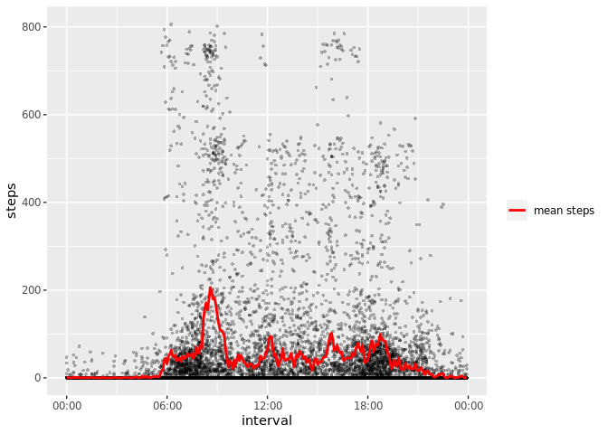

## Loading and preprocessing the data

Let's read the data and look at some of the basic structure with `str` and `summary`.
Converting the `date` column to date format will probably come in handy.


```r
df = read.csv("activity.csv")
df$date = as.Date(df$date)
str(df)
```

```
## 'data.frame':	17568 obs. of  3 variables:
##  $ steps   : int  NA NA NA NA NA NA NA NA NA NA ...
##  $ date    : Date, format: "2012-10-01" "2012-10-01" ...
##  $ interval: int  0 5 10 15 20 25 30 35 40 45 ...
```


```r
summary(df)
```

```
##      steps             date               interval     
##  Min.   :  0.00   Min.   :2012-10-01   Min.   :   0.0  
##  1st Qu.:  0.00   1st Qu.:2012-10-16   1st Qu.: 588.8  
##  Median :  0.00   Median :2012-10-31   Median :1177.5  
##  Mean   : 37.38   Mean   :2012-10-31   Mean   :1177.5  
##  3rd Qu.: 12.00   3rd Qu.:2012-11-15   3rd Qu.:1766.2  
##  Max.   :806.00   Max.   :2012-11-30   Max.   :2355.0  
##  NA's   :2304
```

The first draft of the daily pattern plot below also made clear
the format of the "interval" column basically represents 24h time,
because it leaves gaps (e.g. jumping 50 -> 55 -> 100),
so let's format that as an actual time.
Will have to ignore the extraneous default date and seconds later when labeling.


```r
library(dplyr)
df$interval = df$interval %>%
  sprintf("%04d", .) %>%
  as.POSIXct(format="%H%M")
summary(df)
```

```
##      steps             date               interval                  
##  Min.   :  0.00   Min.   :2012-10-01   Min.   :2022-12-09 00:00:00  
##  1st Qu.:  0.00   1st Qu.:2012-10-16   1st Qu.:2022-12-09 05:58:45  
##  Median :  0.00   Median :2012-10-31   Median :2022-12-09 11:57:30  
##  Mean   : 37.38   Mean   :2012-10-31   Mean   :2022-12-09 11:57:30  
##  3rd Qu.: 12.00   3rd Qu.:2012-11-15   3rd Qu.:2022-12-09 17:56:15  
##  Max.   :806.00   Max.   :2012-11-30   Max.   :2022-12-09 23:55:00  
##  NA's   :2304
```

## What is the mean total number of steps taken per day?

Write a function to do this, since we'll have to do it again later.


```r
library(ggplot2)
daily_totals_calc = function(df) {
  daily_totals = df %>%
    group_by(date) %>%
    summarise(total_steps = sum(steps))
  steps_mean = mean(daily_totals$total_steps, na.rm = TRUE)
  steps_med = median(daily_totals$total_steps, na.rm = TRUE)
  p = ggplot(daily_totals, aes(x=total_steps)) + 
    geom_histogram() +
    geom_vline(aes(xintercept = steps_mean, color="mean"), size=2) +
    geom_vline(aes(xintercept = steps_med, color="median"), size=0.6) +
    scale_color_manual(name = "stats", values = c(median = "blue", mean = "cyan"))
  return(list("mean" = steps_mean, "median" = steps_med, "plot" = p))
}
daily_totals = daily_totals_calc(df)
print(daily_totals$p)
```

<!-- -->

The mean (10766.188679) 
and median (10765.000000) are nearly identical,
right on top of each other in the histogram,
so they had to be plotted with different line widths to actually see them.

## What is the average daily activity pattern?

Let's plot the individual data points as well as the average just for fun.


```r
mean_daily_pattern = df %>%
  group_by(interval) %>%
  summarise(avg_steps = mean(steps, na.rm = TRUE))
avg_most_active = mean_daily_pattern$avg_steps %>%
  which.max() %>%
  mean_daily_pattern$interval[[.]]
# Note when printing this below in the markdown, feed through
#  strftime(avg_most_active, format="%H:%M")
# to get rid of the default today's date and other extraneous stuff
ggplot(df, aes(x=interval, y=steps)) +
  geom_point(alpha=0.3, size=1, shape=16) +
  scale_x_datetime(date_label = "%H:%M") +
  geom_line(
    data=mean_daily_pattern,
    aes(x=interval, y=avg_steps, color="mean steps"),
    size=1) +
  scale_color_manual(name="", values = c("mean steps" = "red"))
```

<!-- -->

On average, the most steps happen at
08:35 - 
during the morning commute maybe!

## Imputing missing values

From the summary stats at the beginning, we saw that only the `steps` column has NAs.
Get those numbers again:


```r
total_na = sum(is.na(df$steps))
total_rows = nrow(df)
```

Specifically, we have 2304 NAs out of 17568 total rows.
About 13.11%.

Let's first try the simplest strategy, replacing all NAs with the global mean.


```r
df_imputed = data.frame(df)
df_imputed$steps[is.na(df$steps)] = mean(df$steps, na.rm=TRUE)
str(df_imputed)
```

```
## 'data.frame':	17568 obs. of  3 variables:
##  $ steps   : num  37.4 37.4 37.4 37.4 37.4 ...
##  $ date    : Date, format: "2012-10-01" "2012-10-01" ...
##  $ interval: POSIXct, format: "2022-12-09 00:00:00" "2022-12-09 00:05:00" ...
```

Now look at the daily totals again.


```r
daily_totals_imputed = daily_totals_calc(df_imputed)
print(daily_totals_imputed$p)
```

<!-- -->

Now the mean daily total is 10766.188679 
and median is 10766.188679,
almost identical to the old mean (10766.188679) 
and median (10765).
The histogram though, shows a clear new spike at the mean/median.
It seems the NAs are probably concentrated in certain days,
rather than spread out.

## Are there differences in activity patterns between weekdays and weekends?

First, create the label for weekdays vs weekends, and make sure it looks good.


```r
df_imputed$day_type = as.factor(case_when(
  weekdays(df_imputed$date) %in% c("Saturday", "Sunday") ~ "weekend",
  TRUE ~ "weekday"))
str(df_imputed)
```

```
## 'data.frame':	17568 obs. of  4 variables:
##  $ steps   : num  37.4 37.4 37.4 37.4 37.4 ...
##  $ date    : Date, format: "2012-10-01" "2012-10-01" ...
##  $ interval: POSIXct, format: "2022-12-09 00:00:00" "2022-12-09 00:05:00" ...
##  $ day_type: Factor w/ 2 levels "weekday","weekend": 1 1 1 1 1 1 1 1 1 1 ...
```

Now plot the daily patterns again, comparing weekdays and weekends.
Simplify it this time to only give the mean timeseries.


```r
mean_daily_pattern_imputed = df_imputed %>%
  group_by(interval, day_type) %>%
  summarise(avg_steps = mean(steps, na.rm = TRUE))
ggplot(mean_daily_pattern_imputed, aes(x=interval, y=avg_steps)) +
  geom_line() +
  scale_x_datetime(date_label = "%H:%M") +
  facet_wrap(~day_type, ncol=1)
```

<!-- -->

Weekends include less early-morning activity, which makes a lot of sense!
